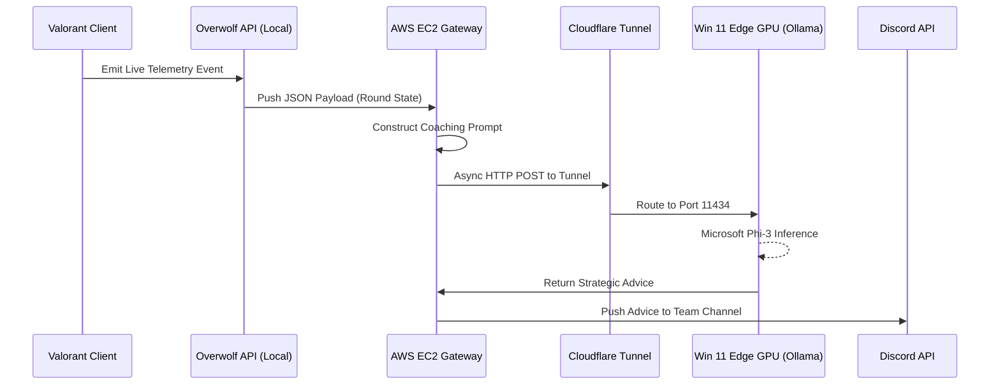

# Rift (Radiant-AI): Future Vision & Roadmap

This document outlines the architectural blueprint for the next major evolution of the Rift project: **Real-Time Esports Coaching**.

While the current deployment provides a robust, generalized AI interface via Discord, the initial project conception centered around dynamic, context-aware coaching for *Valorant*. The goal is to ingest live match telemetry and provide actionable, strategic advice directly into a Discord group channel during gameplay.

---

## 1. The Architectural Challenge: Vanguard Anti-Cheat

The most critical obstacle in developing real-time integrations for Valorant is **Riot Vanguard**, a highly intrusive, kernel-level anti-cheat system. Traditional computer vision (OpenCV) or memory-reading techniques will result in immediate hardware bans.

### The Solution: Sanctioned API Integration
To safely extract match context without triggering Vanguard, the architecture will pivot to utilizing sanctioned, event-driven telemetry platforms like the **Overwolf API** or Riot's official client APIs.

These sanctioned pipelines provide a clean stream of structured data events, including:
* Current Map (e.g., Ascent, Bind, Split)
* Match Phase (e.g., Buy Phase, Mid-Round, Post-Round)
* Current Agent (e.g., Omen, Jett)
* Economy Status (Player credits and team loadouts)
* Kill/Death Feed (KDA tracking)

---

## 2. The Real-Time Data Pipeline

To support this expansion, the existing decoupled architecture (Discord -> AWS -> Cloudflare -> Edge GPU) will be adapted to ingest the new telemetry stream.

### Execution Flow:
1. **Telemetry Ingestion:** A lightweight local daemon monitors the Overwolf event bus during a match.
2. **State Construction:** Upon detecting a key event (e.g., the start of the Buy Phase), the daemon compiles the current state into a JSON object and pushes it to the AWS EC2 Gateway.
3. **Prompt Engineering:** The AWS Gateway transforms the raw telemetry into a structured prompt: *"You are an expert Valorant Radiant-rank coach. Based on this state: [Insert Telemetry], what is the optimal economic strategy for this round?"*
4. **Edge Inference:** The prompt is routed down the Zero-Trust Cloudflare Tunnel to the local NVIDIA RTX 3050, where the Microsoft Phi-3 model generates the coaching advice.
5. **Delivery:** The Gateway receives the AI response and broadcasts it to the team's Discord channel.

---

## 3. Engineering Trade-offs & Constraints

Implementing real-time AI processing introduces several critical architectural challenges that must be managed.

### A. The Latency Constraint
* **The Problem:** Valorant requires split-second tactical decisions. If the full round-trip inference (Local -> AWS -> Tunnel -> Edge GPU -> Discord) takes 5+ seconds, mid-round tactical advice (e.g., during a fast execute) will arrive too late and distract the players.
* **The Mitigation:** The coaching AI will be strictly constrained to **Pre-Round (Buy Phase)** and **Post-Round (Macro Analysis)** contexts. Telemetry triggers will only fire when the round timers halt, providing the AI a 15-30 second window to deliver economic or macro-positioning advice without impacting active gunfights.

### B. The Text-Only Limitation (4GB VRAM)
* **The Problem:** The current hardware constraint is an NVIDIA RTX 3050 with a strict 4GB VRAM limit. This budget perfectly fits the text-based Microsoft Phi-3 model, but it is impossible to run a Multi-Modal vision model (like Llama 3.2 Vision) locally within this footprint.
* **The Mitigation:** The AI cannot "watch" the game via video feed. Its intelligence is entirely dependent on the quality of the structured text telemetry fed into it via the API. The prompt engineering layer on the AWS Gateway must be highly sophisticated to provide accurate situational awareness.

### C. Managing the Context Window
* **The Problem:** Sending the entire historical match log (every kill, death, and economy change for the past 15 rounds) in every prompt will quickly exceed the model's token limit, causing inference failure and drastically slowing down response times.
* **The Mitigation:** The AWS Gateway will maintain a rolling "sliding window" of context. It will compress past rounds into aggregate statistics (e.g., "Enemy team has favored hitting A Site 70% of the time") rather than sending raw chronological logs.
