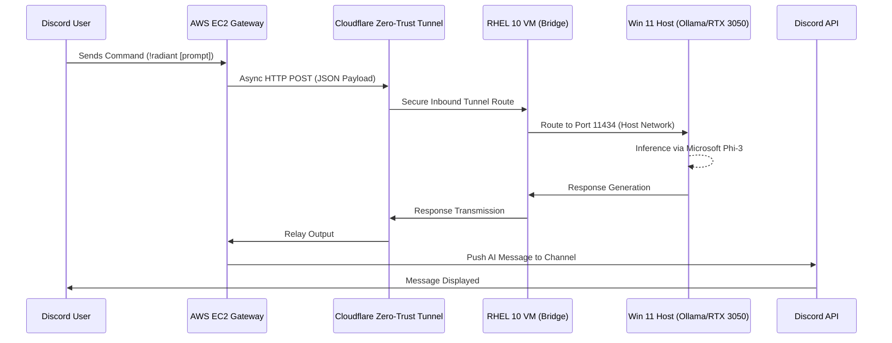

# Rift - Decoupled Edge Inference Bridge


*A Zero-Trust, Hybrid Cloud pipeline routing Discord commands to a local edge-inference GPU.*

## Executive Summary

Rift is an enterprise-grade, event-driven pipeline designed to bring Sovereign AI to external interfaces without compromising security or budget. By bridging public cloud frontend infrastructure with localized private edge hardware, Rift delivers the power of Large Language Models (LLMs) directly into Discord communities.

The architecture strictly adheres to a **Zero-Trust** network paradigm. The heavy-lift GPU processing remains entirely localized and isolated, while a lightweight, secure gateway handles public interactions. This decoupling allows users to interact with high-performance AI inference while keeping data securely on-premises.

## Architecture Flow

The system employs a decentralized architecture, moving user commands from a public discord interface through an encrypted tunnel down to a bare-metal edge GPU.



## FinOps & SecOps Posture

This architecture was explicitly designed to optimize for both OPEX (Operating Expenses) and Data Sovereignty.

### FinOps (Cost Optimization)
* **Traditional Cloud AI:** Hosting an LLM on AWS requires dedicated GPU instances (e.g., `g4dn.xlarge`), typically costing **$380 - $500/month**.
* **Rift Architecture:** By routing inference logic to pre-existing edge hardware (NVIDIA RTX 3050), the cloud footprint is constrained to a single lightweight `t3.micro` EC2 instance. This instance is often covered by the AWS Free Tier, resulting in operational costs of **<$10/month**. This effectively yields a **~98% reduction in cloud inference hosting costs**.

### SecOps (Zero-Trust Security)
* **Sovereign AI:** Because the model runs entirely on local bare-metal hardware, sensitive prompt data is never routed through third-party telemetry APIs (such as OpenAI or Anthropic).
* **Inbound Protection:** The Cloudflare Tunnel utilizes an outbound-only connection. **Zero ports** are opened on the local home network router, ensuring the edge GPU remains entirely invisible to the public internet.

## Deployment Guide

### Prerequisites
- An active AWS EC2 environment (`t3.micro` running Amazon Linux / RHEL).
- An established Cloudflare Zero-Trust Network.
- A local Windows Host with an NVIDIA GPU running [Ollama](https://ollama.ai/).

### 1. Local Ollama Initialization (Windows Host)
Ensure that the Ollama service is bound and listening for incoming network requests.

```powershell
# Disable background tray app to prevent binding collisions
Stop-Process -Name "ollama" -Force

# Pull the lightweight model
ollama pull phi3

# Serve on the required port
ollama serve
```

### 2. Tunnel Execution (RHEL 10 VM Bridge)
Establish the connection between your local environment and Cloudflare.

```bash
# Execute your securely configured Cloudflare Quick Tunnel
cloudflared tunnel run <your-tunnel-name>
```

### 3. AWS Service Daemon (EC2 Gateway)
Provision the gateway to run the asynchronous listener 24/7.

```bash
# Update and ensure dependencies exist
sudo dnf install git python3 python3-pip -y

# Clone repository & set up environment
git clone <repository-url> /home/ec2-user/rift-inference-bridge
cd /home/ec2-user/rift-inference-bridge
pip3 install -r requirements.txt

# Create .env file with your Discord Token
echo "DISCORD_TOKEN=your_token_here" > .env

# Generate systemd configuration and daemonize
sudo bash daemonize.sh
```

## Incident Log / Troubleshooting (Battle Scars)

During the engineering lifecycle, several infrastructural roadblocks were successfully mitigated:

* **Incident 1: The HTTP 405 (Method Not Allowed) Routing Error**
  * *Symptom:* Cloudflare successfully routed to the Ollama host, but the Ollama service rejected the request.
  * *Resolution:* The AWS payload was incorrectly hitting the root `POST "/"` endpoint. Re-engineered the tunnel configuration in `bot.py` to strictly target the `POST "/api/generate"` endpoint.

* **Incident 2: The HTTP 500 (Internal Server Error) CUDA Deadlock**
  * *Symptom:* Ollama timed out after ~5.6 seconds, failing to initialize shared object memory.
  * *Root Cause:* The initial model selection (`llama3`) exceeded the available 4GB VRAM budget on the edge hardware (RTX 3050), causing the Windows Display Driver (WDDM) to lock the memory stack.
  * *Resolution:* Re-architected the inference pipeline to utilize Microsoft `phi3`, significantly reducing the VRAM footprint and ensuring stable headroom. Implemented a host reboot sequence to clear pinned VRAM.

* **Incident 3: The HTTP 400 (Bad Request) Discord Limit**
  * *Symptom:* The AI generated robust responses that exceeded Discord's hard 2,000-character payload limit.
  * *Resolution:* Developed a localized safety truncation protocol within `bot.py` (`ai_reply[:1900]`) to gracefully slice excess text and append an automated truncation warning.
